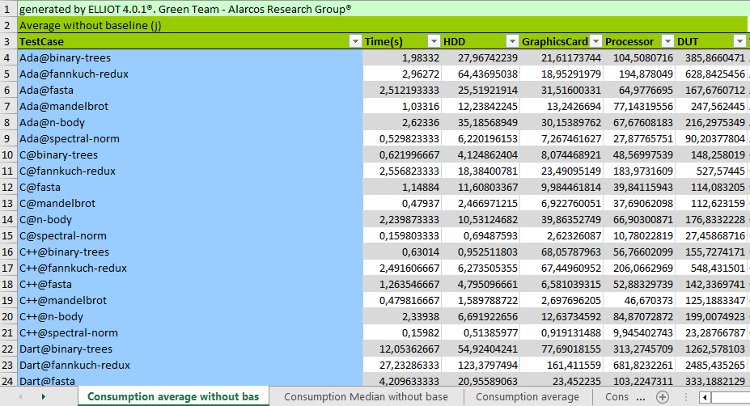
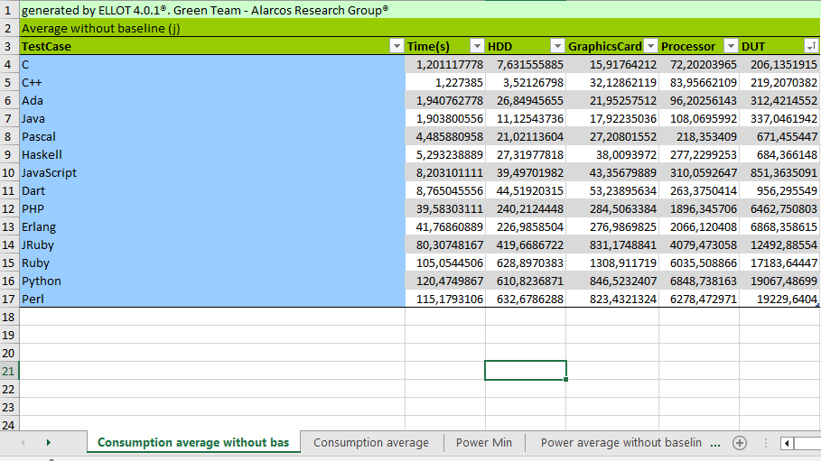

## Report folder

The report folder include all the information on the analysis of the energy consumption of the forware. It is structured as follows:

```Java
| ...
| <EntityClass-1>@<TestCase-1>.xls
| ...
| <EntityClass-i>@<TestCase-i>.xls
| testcases_total.xls
| versions_total.xls

```

The report folder contains 10 Excel files containing the analysis data. One for each test case named `<EntityClass>@<TestCase>`. It also contains two files "testcases_total" and "versions_total" with the summary of the test case and version information respectively.
As an example, the following images show the information of a test case.

The first image shows all the information of a measurement.


The second image shows all the information of a test case.


To facilitate the comparison of information, the file "testcases_total" contains one sheet for each statistical value of all test cases. These statistical values are:
Consumption average without baseline, Consumption median without baseline, Consumption average (with baseline), Consumption median (with baseline), Baseline, Power min, Power average without baseline, Power average (with baseline), Power median without baseline, Power median (with baseline), Trimmed mean to 20%, Winsorized mean to 20%, Geometric mean, Mean standard deviation, Mean variance, Standard deviation among measurments and Variance among measurments



In the same way as the "testcase_total" document, the "versions_total" document contains the statistical values for each Entity Class.




